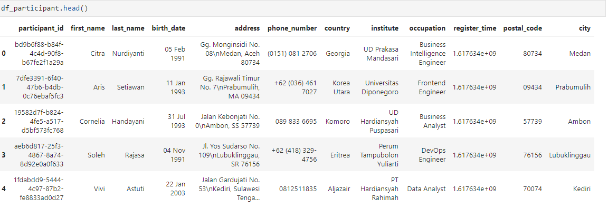
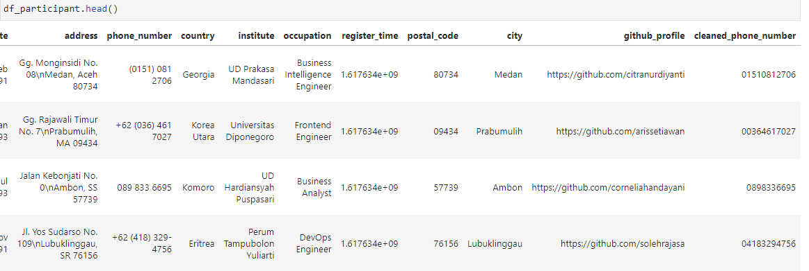
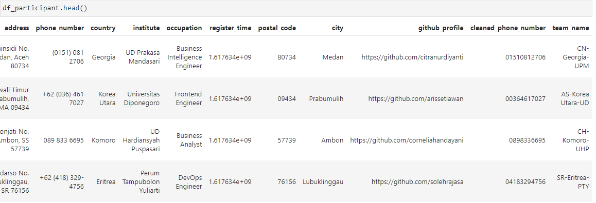
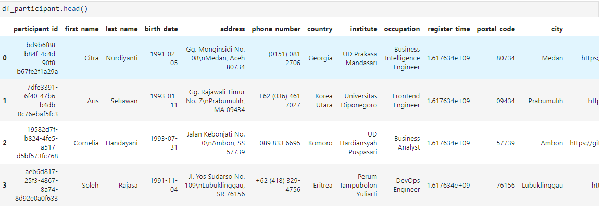

# Project Simple ETL with Pandas

## Pengantar
Di masa pandemi seperti ini, kompetisi coding seperti Competitive Programming maupun Hackathon banyak diselenggarakan karena sangat memungkinkan untuk dilakukan secara online.

**Hackathon** merupakan kompetisi membuat perangkat lunak (software) yang dilaksanakan secara marathon yang biasanya diikuti secara tim. Umumnya, peserta hackathon diminta untuk mengembangkan platform (mobile, web, desktop, dll.) dalam kurun waktu tertentu untuk menyelesaikan permasalahan yang sudah ditetapkan/didefinisikan oleh penyelenggara ataupun berdasarkan tema yang dipilih oleh tim tersebut.

Untuk bisa mengikuti hackathon dari suatu instansi, calon peserta diwajibkan untuk mendaftarkan diri mereka pada situs/form tertentu dengan memasukkan beberapa informasi yang diminta oleh penyelenggara tersebut.

 

**Extract, Transform dan Load (ETL)** merupakan kumpulan proses untuk "memindahkan" data dari satu tempat ke tempat lain.
Tempat yang dimaksud adalah dari sumber data (bisa berupa database aplikasi, file, logs, database dari 3rd party, dan lainnya) ke data warehouse.

Apa itu data warehouse?

Singkatnya, data warehouse merupakan database yang berisi data-data (tabel-tabel) yang sudah siap untuk dilakukan analisis oleh Data Analyst maupun Data Scientist.

Lebih lengkapnya bisa dilihat di:
https://en.wikipedia.org/wiki/Data_warehouse.

Pada modul ini kita akan mempelajari masing-masing dari proses tersebut.

## Project yang Akan Dikerjakan
Pada proyek kali ini, Anda diminta untuk mengolah data pendaftar hackathon yang diselenggarakan oleh DQLab bernama DQThon.

Dataset ini terdiri dari 5000 baris data (5000 pendaftar) dengan format CSV (Comma-separated values) dan memiliki beberapa kolom diantaranya:

1. **participant_id**: ID dari peserta/partisipan hackathon. Kolom ini bersifat unique sehingga antar peserta pasti memiliki ID yang berbeda
2. **first_name**: nama depan peserta
3. **last_name**: nama belakang peserta
4. **birth_date**: tanggal lahir peserta
5. **address**: alamat tempat tinggal peserta
6. **phone_number**: nomor hp/telepon peserta
7. **country**: negara asal peserta
8. **institute**: institusi peserta saat ini, bisa berupa nama perusahaan maupun nama universitas
9. **occupation**: pekerjaan peserta saat ini
10. **register_time**: waktu peserta melakukan pendaftaran hackathon dalam second

Namun pada proyek ini nantinya Anda diminta untuk menghasilkan beberapa kolom dengan memanfaatkan kolom-kolom yang ada, sehingga akhir dari proyek ini berupa hasil transformasi data dengan beberapa kolom baru selain dari 10 kolom diatas.

Sebagai pemanasan dalam proyek ini, Anda dipersilakan untuk membuka isi datasetnya dan melihat values-nya. Jika sudah siap dengan perjalanan di proyek ini.

## Transform Data

### Extract
Extract merupakan proses meng-ekstraksi data dari sumber, sumber data ini bisa berupa relational data (SQL) atau tabel, nonrelational (NoSQL) maupun yang lainnya.

Tugas Anda adalah baca terlebih dahulu dataset ini sebagai CSV agar nantinya bisa diolah. Gunakan live code editor untuk menampilkan dataset.

File tersebut bisa diakses melalui URL: https://storage.googleapis.com/dqlab-dataset/dqthon-participants.csv.

### Transform
Transform merupakan proses melakukan transformasi data, atau perubahan terhadap data. Umumnya seperti:

1. Merubah nilai dari suatu kolom ke nilai baru,
2. Menciptakan kolom baru dengan memanfaatkan kolom lain,
3. Transpose baris menjadi kolom (atau sebaliknya),
4. Mengubah format data ke bentuk yang lebih standard (contohnya, kolom date, maupun datetime yang biasanya memiliki nilai yang tidak standard maupun nomor HP yang biasanya memiliki nilai yang tidak sesuai format standardnya), dan lainnya. 

### Transform Bagian I - Kode Pos
Ada permintaan datang dari tim logistik bahwa mereka membutuhkan kode pos dari peserta agar pengiriman piala lebih mudah dan cepat sampai. Maka dari itu buatlah kolom baru bernama postal_code yang memuat informasi mengenai kode pos yang diambil dari alamat peserta (kolom address).

Diketahui bahwa kode pos berada di paling akhir dari alamat tersebut.

Note:
Jika regex yang dimasukkan tidak bisa menangkap pattern dari value kolom address maka akan menghasilkan NaN.

### Transform Bagian II - Kota

Selain kode pos, mereka juga membutuhkan kota dari peserta.

Untuk menyediakan informasi tersebut, buatlah kolom baru bernama **city** yang didapat dari kolom **address**. Diasumsikan bahwa kota merupakan sekumpulan karakter yang terdapat setelah nomor jalan diikuti dengan \n (newline character) atau dalam bahasa lainnya yaitu enter.

### Transform Bagian III - Github

Salah satu parameter untuk mengetahui proyek apa saja yang pernah dikerjakan oleh peserta yaitu dari git repository mereka.

Pada kasus ini kita menggunakan profil github sebagai parameternya. Tugas Anda yaitu membuat kolom baru bernama **github_profile** yang merupakan link profil github dari peserta.

Diketahui bahwa profil github mereka merupakan gabungan dari **first_name** dan **last_name** yang sudah di-lowercase. 

### Transform Bagian IV - Nomor Handphone

Jika kita lihat kembali, ternyata nomor handphone yang ada pada data csv kita memiliki format yang berbeda-beda. Maka dari itu, kita perlu untuk melakukan cleansing pada data nomor handphone agar memiliki format yang sama. Anda sebagai Data Engineer diberi privilege untuk menentukan format nomor handphone yang benar. Pada kasus ini mari kita samakan formatnya dengan aturan:

1. Jika awalan nomor HP berupa angka 62 atau +62 yang merupakan kode telepon Indonesia, maka diterjemahkan ke 0.
2. Tidak ada tanda baca seperti kurung buka, kurung tutup, strip⟶ ()-
3. Tidak ada spasi pada nomor HP nama kolom untuk menyimpan hasil cleansing pada nomor HP yaitu **cleaned_phone_number**

### Transform Bagian V - Nama Tim

Dataset saat ini belum memuat nama tim, dan rupanya dari tim Data Analyst membutuhkan informasi terkait nama tim dari masing-masing peserta.

Diketahui bahwa nama tim merupakan gabungan nilai dari kolom **first_name, last_name, country dan institute**.

Tugas Anda yakni buatlah kolom baru dengan nama **team_name** yang memuat informasi nama tim dari peserta.

### Transform Bagian VI - Email

Setelah dilihat kembali dari data peserta yang dimiliki, ternyata ada satu informasi yang penting namun belum tersedia, yaitu email.

Anda sebagai Data Engineer diminta untuk menyediakan informasi email dari peserta dengan aturan bahwa format email sebagai berikut:

Format email:
xxyy@aa.bb.[ac/com].[cc]

Keterangan:
xx -> nama depan (first_name) dalam lowercase
yy -> nama belakang (last_name) dalam lowercase
aa -> nama institusi

Untuk nilai bb, dan cc mengikuti nilai dari aa. Aturannya:
- Jika institusi nya merupakan Universitas, maka
  bb -> gabungan dari huruf pertama pada setiap kata dari nama Universitas dalam lowercase
  Kemudian, diikuti dengan .ac yang menandakan akademi/institusi belajar dan diikuti dengan pattern cc
- Jika institusi bukan merupakan Universitas, maka
  bb -> gabungan dari huruf pertama pada setiap kata dari nama Universitas dalam lowercase
  Kemudian, diikuti dengan .com. Perlu diketahui bahwa pattern cc tidak berlaku pada kondisi ini

cc -> merupakan negara asal peserta, adapun aturannya:
- Jika banyaknya kata pada negara tersebut lebih dari 1 maka ambil singkatan dari negara tersebut dalam lowercase
- Namun, jika banyaknya kata hanya 1 maka ambil 3 huruf terdepan dari negara tersebut dalam lowercase

Contoh: 
  Nama depan: Citra 
  Nama belakang: Nurdiyanti 
  Institusi: UD Prakasa Mandasari 
  Negara: Georgia 
  Maka, Email nya: citranurdiyanti@upm.geo
  -----------------------------------
  Nama depan: Aris 
  Nama belakang: Setiawan 
  Institusi: Universitas Diponegoro 
  Negara: Korea Utara 
  Maka, Email nya: arissetiawan@ud.ac.ku
  

  
### Transform Bagian VII - Tanggal Lahir
  
MySQL merupakan salah satu database yang sangat populer dan digunakan untuk menyimpan data berupa tabel, termasuk data hasil pengolahan yang sudah kita lakukan ini nantinya bisa dimasukkan ke MySQL.

Meskipun begitu, ada suatu aturan dari MySQL terkait format tanggal yang bisa mereka terima yaitu YYYY-MM-DD dengan keterangan:

- YYYY: 4 digit yang menandakan tahun
- MM: 2 digit yang menandakan bulan
- DD: 2 digit yang menandakan tanggal

Contohnya yaitu: 2021-04-07

Jika kita lihat kembali pada kolom tanggal lahir terlihat bahwa nilainya belum sesuai dengan format DATE dari MySQL.

Oleh karena itu, lakukanlah formatting terhadap kolom birth_date menjadi YYYY-MM-DD dan simpan di kolom yang sama.

### Transform Bagian VIII - Tanggal Daftar Kompetisi
Selain punya aturan mengenai format DATE, MySQL juga memberi aturan pada data yang bertipe DATETIME yaitu YYYY-MM-DD HH:mm:ss dengan keterangan:

- YYYY: 4 digit yang menandakan tahun
- MM: 2 digit yang menandakan bulan
- DD: 2 digit yang menandakan tanggal
- HH: 2 digit yang menandakan jam
- mm: 2 digit yang menandakan menit
- ss: 2 digit yang menandakan detik

Contohnya yaitu: 2021-04-07 15:10:55

Karena data kita mengenai waktu registrasi peserta (register_time) belum sesuai format yang seharusnya.

Maka dari itu, tugas Anda yaitu untuk merubah register_time ke format DATETIME sesuai dengan aturan dari MySQL.

Simpanlah hasil tersebut ke kolom register_at.

## Kesimpulan
Dengan begitu, tibalah kita di penghujung dari chapter bagian transform ini.

Jika dilihat kembali, dataset Anda saat ini sudah berbeda dengan saat proses extract sebelumnya. Ada beberapa kolom tambahan yang memanfaatkan nilai kolom lain.

Dataset Anda saat ini memuat kolom:

1. participant_id: ID dari peserta/partisipan hackathon. Kolom ini bersifat unique sehingga antar peserta pasti memiliki ID yang berbeda
2. first_name: nama depan peserta
3. last_name: nama belakang peserta
4. birth_date: tanggal lahir peserta (sudah diformat ke YYYY-MM-DD)
5. address: alamat tempat tinggal peserta
6. phone_number: nomor hp/telepon peserta
7. country: negara asal peserta
8. institute: institusi peserta saat ini, bisa berupa nama perusahaan maupun nama universitas
9. occupation: pekerjaan peserta saat ini
10. register_time: waktu peserta melakukan pendaftaran hackathon dalam second
11. team_name: nama tim peserta (gabungan dari nama depan, nama belakang, negara dan institusi)
12. postal_code: kode pos alamat peserta (diambil dari kolom alamat)
13. city: kota peserta (diambil dari kolom alamat)
14. github_profile: link profil github peserta (gabungan dari nama depan, dan nama belakang)
15. email: alamat email peserta (gabungan dari nama depan, nama belakang, institusi dan negara)
16. cleaned_phone_number: nomor hp/telepon peserta (sudah lebih sesuai dengan format nomor telepon)
17. register_at: tanggal dan waktu peserta melakukan pendaftaran (sudah dalam format DATETIME)

## Load
Pada bagian load ini, data yang sudah ditransformasi sedemikian rupa sehingga sesuai dengan kebutuhan tim analyst dimasukkan kembali ke database yaitu Data Warehouse (DWH). Biasanya, dilakukan pendefinisian skema database terlebih dahulu seperti:

1. Nama kolom
2. Tipe kolom
3. Apakah primary key, unique key, index atau bukan
4. Panjang kolomnya

Karena umumnya Data Warehouse merupakan database yang terstruktur sehingga mereka memerlukan skema sebelum datanya dimasukkan.

Pandas sudah menyediakan fungsi untuk memasukkan data ke database yaitu to_sql().

Detail dari fungsi tersebut bisa dilihat pada dokumentasi Pandas: https://pandas.pydata.org/docs/reference/api/pandas.DataFrame.to_sql.html